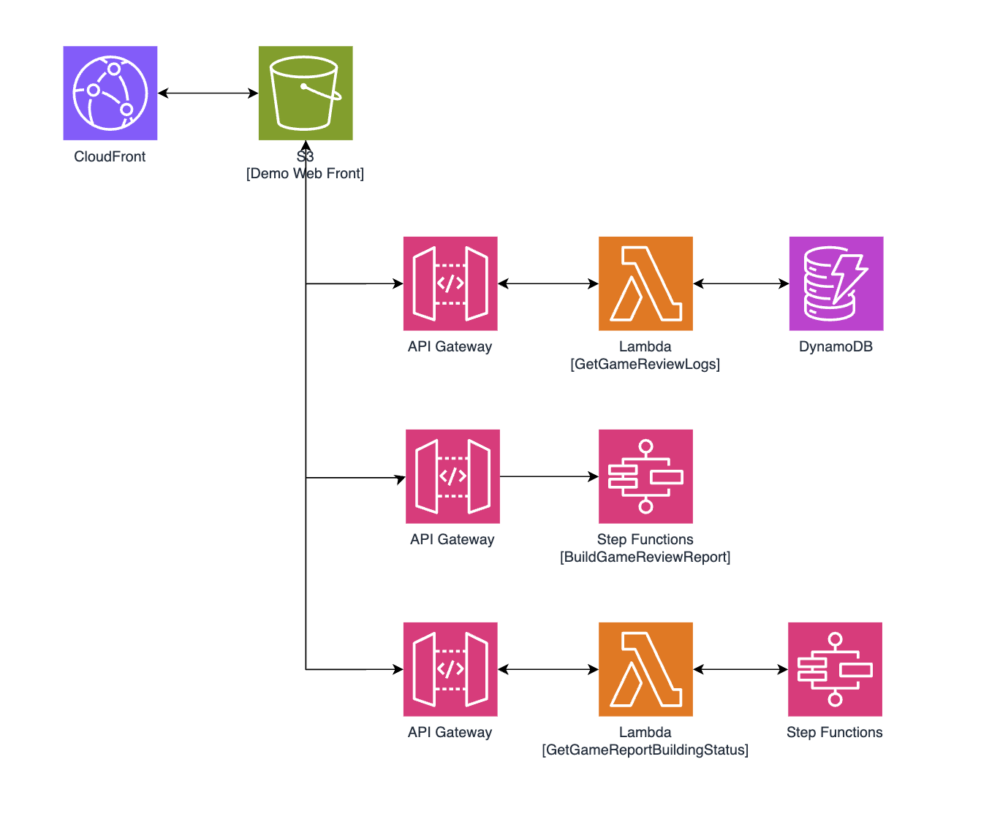
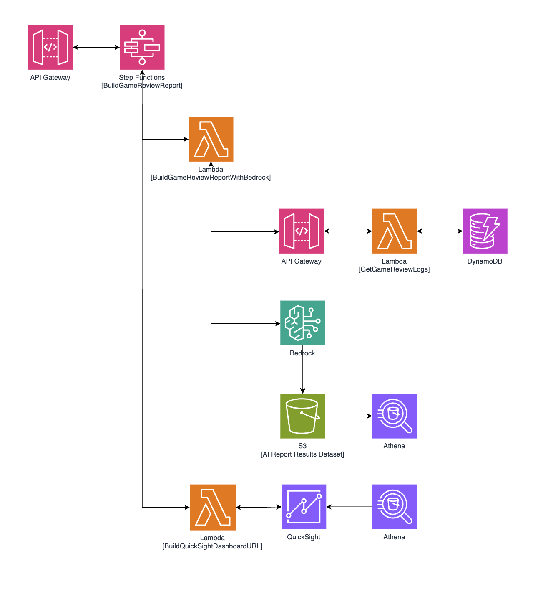
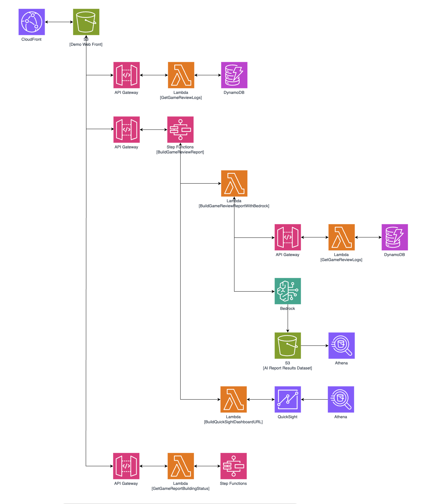

# 게임 리뷰 AI 분석 보고서 생성 DEMO

## 소개

커뮤니티에서 크롤링한 유저들의 리뷰를 AWS Bedrock의 생성형 AI로 분석하여 QuickSight로 보고서로 만들어주는 아키텍처의 DEMO와 소스입니다.
DEMO는 다음 링크에서 테스트 가능 합니다.
[https://bit.ly/game-review-ai-report-demo] 

DEMO 설명
- 2025년 4월1일부터 4월30일까지의 가상 게임의 리뷰가 조회가능 합니다(생성형 AI로 만든 가상 리뷰).
- 리뷰 조회 후 "보고서 생성"을 클릭하면 실시간으로 QuickSight 보고서를 생성하여 출력합니다.

## 아키텍처
DEMO 웹사이트의 아키텍처입니다.
S3와 CloundFront를 통해 호스팅되며, API-Gateway를 통해 3개의 API가 호출됩니다.

- 리뷰 조회 API
- 보고서 생성 API
- 보고서 생성 진행상황 조회 API

Step Functions 를 호출하는 보고서 생성 API의 상세 아키텍처 입니다.

전체 아키텍처 입니다.

